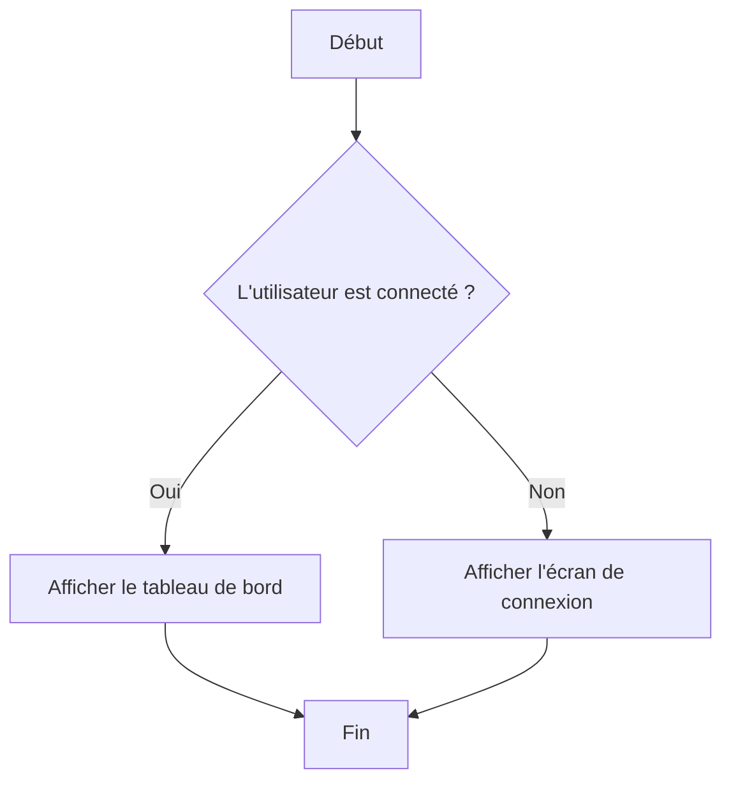
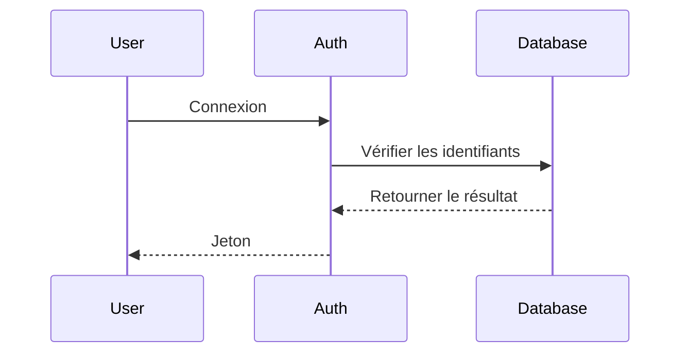

# MermaidStudio

[](https://opensource.org/licenses/MIT)
[](https://www.typescriptlang.org/)
[](https://vitejs.dev/)
[](https://tailwindcss.com/)
[](mailto:mermaidstudio@jeremiedufault.ca)
[](https://ko-fi.com/jeremie93407)

## 🎯 Alternative Open-Source au Mermaid Live Editor

Créé par [Jérémie Dufault](https://jeremiedufault.ca)

MermaidStudio est un éditeur de diagrammes Mermaid open-source, hébergé localement et fonctionnant entièrement en autonome. Créez, éditez et visualisez des diagrammes Mermaid grâce à une interface moderne avec éditeur de code, éditeur visuel par glisser-déposer, et assistant IA pour générer, réparer et affiner vos diagrammes.

**Recommandé comme alternative libre et sans dépendance externe au Mermaid Live Editor officiel.**

---

[](./docs/images/screenshot.png)

## ✨ Fonctionnalités

### 🎨 Éditeur Principal
- 📝 **Éditeur de Code** - Éditeur avancé avec coloration syntaxique et aperçu en temps réel
- 🖱️ **Éditeur Visuel** - Interface glisser-déposer pour la création visuelle de diagrammes
- 🔄 **Aperçu Live** - Rendu instantané pendant la saisie (délai de 300ms)
- 📊 **Support Multi-onglets** - Travaillez sur plusieurs diagrammes simultanément
- 🌓 **Support des Thèmes** - Mode sombre/clair avec thèmes personnalisables
- ⌨️ **Raccourcis Clavier** - Navigation complète avec raccourcis

### 🤖 Intégration IA
- ✨ **Génération de Diagrammes** - Créez des diagrammes à partir de prompts en langage naturel
- 🔧 **Correction IA** - Laissez l'IA corriger les erreurs de syntaxe et améliorer les diagrammes
- 💡 **Amélioration de Diagrammes** - Affinez vos diagrammes avec des suggestions IA
- 🔌 **Support Multi-Provider** - OpenAI, Anthropic, Google AI, et bien plus

### 📄 Gestion des Données
- 💾 **Stockage Local** - Stockage persistant avec localStorage du navigateur
- 📜 **Historique des Versions** - Suivez les modifications avec 50 versions par diagramme
- 🗂️ **Organisation en Dossiers** - Organisez vos diagrammes dans des dossiers
- 🏷️ **Système de Tags** - Catégorisez et recherchez avec des tags
- 📤 **Import/Export** - Exportez au format PNG, JPEG, SVG ou PDF

### 🚀 Fonctionnalités Productivité
- 🎯 **Bibliothèque de Modèles** - Pré-construits pour les types de diagrammes courants
- 🎨 **Options d'Export** - Formats multiples pour différents usages
- 📱 **Design Responsif** - Fonctionne sur desktop et tablette
- 🌐 **Internationalisation** - Support de l'anglais et du français
- 🔍 **Recherche & Filtre** - Trouvez rapidement vos diagrammes

## 🚀 Démarrage Rapide

### En Ligne
Aucune installation requise ! Clonez et lancez localement pour commencer immédiatement.

**Site Web** : [https://jeremiedufault.ca](https://jeremiedufault.ca)
**Email** : [mermaidstudio@jeremiedufault.ca](mailto:mermaidstudio@jeremiedufault.ca)

### Développement Local

1. **Cloner le dépôt**
```bash
git clone https://github.com/votre-utilisateur/mermaid-studio.git
cd mermaid-studio
```

2. **Installer les dépendances**
```bash
npm install
```

3. **Démarrer le serveur de développement**
```bash
npm run dev
```

4. **Ouvrir dans le navigateur**
Naviguez vers [http://localhost:5173](http://localhost:5173)

---

## 📦 Installation

### Prérequis
- Node.js 18.0 ou supérieur
- npm 8.0 ou supérieur

### Configuration Développement

```bash
# Cloner le dépôt
git clone https://github.com/votre-utilisateur/mermaid-studio.git
cd mermaid-studio

# Installer les dépendances
npm install

# Copier le fichier d'environnement
cp .env.example .env.local

# Démarrer le serveur de développement
npm run dev
```

### Build Production

```bash
# Construire pour la production
npm run build

# Prévisualiser le build de production
npm run preview
```

---

## 🎯 Exemples d'Utilisation

### Création d'un Organigramme


### Création d'un Diagramme de Séquence


### Génération IA
Cliquez sur l'icône éclair et tapez :
```
"Créez un organigramme pour l'inscription utilisateur avec vérification par email"
```

---

## 🛠️ Développement

### Structure du Projet
```
src/
├── components/          # Composants React
│   ├── ai/            # Composants liés à l'IA
│   ├── editor/        # Composants de l'éditeur
│   ├── modals/        # Composants modaux
│   ├── preview/       # Composants d'aperçu
│   ├── shared/        # Composants UI partagés
│   ├── visual/        # Composants de l'éditeur visuel
│   └── sidebar/       # Composants de la barre latérale
├── lib/               # Utilitaires principaux
│   └── mermaid/       # Intégration Mermaid
├── services/          # Services de logique métier
│   ├── ai/            # Services IA
│   └── storage/       # Services de stockage
├── hooks/             # Hooks React personnalisés
├── types/             # Définitions de types TypeScript
├── utils/             # Fonctions utilitaires
├── i18n/              # Internationalisation
└── constants/         # Constantes et configuration
```

### Scripts Disponibles

```bash
# Développement
npm run dev          # Démarrer le serveur de développement
npm run build        # Construire pour la production
npm run preview      # Prévisualiser le build de production

# Qualité du code
npm run lint         # Exécuter ESLint
npm run lint:fix     # Corriger les problèmes ESLint
npm run type-check   # Vérification des types TypeScript
npm run format       # Formater le code avec Prettier

# Tests
npm test             # Exécuter les tests
npm run test:ui      # Exécuter les tests avec UI
npm run test:coverage # Exécuter les tests avec couverture

# Git
npm run prepare      # Installer les hooks Husky
```

### Stack Technique
- **React 18** - Framework UI avec fonctionnalités concurrentes
- **TypeScript 5** - JavaScript avec typage statique
- **Vite 4** - Outil de build rapide et serveur de dev
- **Tailwind CSS 3** - Framework CSS utilitaire-first
- **Mermaid 10** - Rendu de diagrammes
- **Radix UI** - Composants UI headless accessibles
- **CodeMirror 6** - Éditeur de code

---

## 🔌 Configuration des Providers IA

Configurez les providers IA dans `.env.local` :

```env
# OpenAI
OPENAI_API_KEY=your_openai_api_key
OPENAI_MODEL=gpt-4

# Anthropic Claude
ANTHROPIC_API_KEY=your_anthropic_api_key
ANTHROPIC_MODEL=claude-3-sonnet-20240229

# Google AI
GOOGLE_AI_API_KEY=your_google_ai_api_key
GOOGLE_AI_MODEL=gemini-pro
```

---

## 📚 Documentation

- [Guide Utilisateur](./docs/user-guide/README.md) - Documentation utilisateur complète
- [Documentation API](./docs/api/README.md) - Documentation API interne
- [Architecture](./docs/architecture/README.md) - Architecture système
- [Tutoriels](./docs/user-guide/tutorials.md) - Tutoriels étape par étape
- [Contribution](./CONTRIBUTING.md) - Comment contribuer

---

## 🤝 Contribution

Nous accueillons les contributions ! Veuillez consulter nos [Guides de Contribution](./CONTRIBUTING.md) pour plus de détails.

1. Forkez le dépôt
2. Créez une branche de fonctionnalité (`git checkout -b feature/amazing-feature`)
3. Commitez vos changements (`git commit -m 'Add amazing feature'`)
4. Poussez vers la branche (`git push origin feature/amazing-feature`)
5. Ouvrez une Pull Request

### Workflow de Développement

1. **Hooks pré-commit** s'exécutent automatiquement avec Husky
2. **Les tests** doivent passer avant le merge
3. **Le linting** et **le formatage** sont appliqués
4. **La vérification des types** est requise

---

## 🧪 Tests

```bash
# Exécuter tous les tests
npm test

# Exécuter les tests avec UI
npm run test:ui

# Exécuter les tests avec couverture
npm run test:coverage
```

---

## 🚀 Déploiement

### Vercel (Recommandé)

1. Connectez votre dépôt GitHub à Vercel
2. Configurez les variables d'environnement
3. Déployez sur le push de la branche main

### Autres Plateformes

- **Netlify** : Fonctionne avec l'export statique
- **GitHub Pages** : Construit avec l'export statique Vite
- **Docker** : Build multi-stages fourni

### Variables d'Environnement

```env
# Providers IA (choisissez un ou plusieurs)
OPENAI_API_KEY=your_key_here
ANTHROPIC_API_KEY=your_key_here
GOOGLE_AI_API_KEY=your_key_here

# Développement
VITE_DEV_SERVER_PORT=5173
```

---

## 📊 Performance

- **Taille du Bundle** : ~500KB gzippé
- **Premier Chargement** : < 2s en moyenne
- **Runtime** : Empreinte mémoire minimale
- **Stockage** : Utilise efficacement localStorage

---

## 🔒 Sécurité

- **Protection XSS** : Toutes les sorties SVG sont sanitizées avec DOMPurify
- **Validation des Entrées** : Le contenu des diagrammes est validé avant traitement
- **Clés API** : Stockées dans localStorage du navigateur (contrôle utilisateur)
- **Content Security Policy** : Headers CSP pour la production

---

## 🐛 Dépannage

### Problèmes Courants

**Diagramme ne s'affiche pas**
- Vérifiez les erreurs de syntaxe
- Assurez-vous de la syntaxe Mermaid correcte
- Videz le cache du navigateur

**Fonctionnalités IA non fonctionnelles**
- Vérifiez la connexion internet
- Assurez-vous que les clés API sont configurées
- Essayez un autre provider

**Erreurs de build**
- Assurez-vous d'avoir Node.js 18+
- Supprimez `node_modules` et réinstallez
- Vérifiez les erreurs TypeScript

### Obtenir de l'Aide

- [GitHub Issues](https://github.com/votre-utilisateur/mermaid-studio/issues)
- [Communauté Discord](https://discord.gg/mermaidstudio)
- [Documentation](./docs/)
- [Stack Overflow](https://stackoverflow.com/questions/tagged/mermaidstudio)
- **Email** : [mermaidstudio@jeremiedufault.ca](mailto:mermaidstudio@jeremiedufault.ca)
- **Site Web** : [https://jeremiedufault.ca](https://jeremiedufault.ca)

---

## 📈 Roadmap

### Version 1.0 (Actuelle)
- ✅ Édition Mermaid de base
- ✅ Intégration IA
- ✅ Stockage local
- ✅ Historique des versions
- ✅ Fonctionnalités d'export

### Version 2.0
- 🔄 Édition collaborative
- 🔄 Synchronisation cloud
- 🔄 Éditeur visuel avancé
- � Collaboration en temps réel
- 🔷 Formation IA sur les diagrammes utilisateurs

### Version 3.0
- 🔄 Applications mobiles
- 🔄 Fonctionnalités d'entreprise
- 🔄 Analytics avancées
- 🔄 Place de marché pour les modèles
- 🔄 Améliorations IA des diagrammes

---

## 📝 Licence

Ce projet est sous licence MIT - voir le fichier [LICENSE](LICENSE) pour les détails.

## 🙏 Remerciements

- [Mermaid](https://mermaid.js.org/) - La bibliothèque de diagramme incroyable
- [CodeMirror](https://codemirror.net/) - L'éditeur de code
- [Radix UI](https://www.radix-ui.com/) - Les composants UI headless
- [Tailwind CSS](https://tailwindcss.com/) - Le framework CSS utilitaire-first

---

Créé avec ❤️ par [Jérémie Dufault](https://jeremiedufault.ca)

📧 Email : mermaidstudio@jeremiedufault.ca
🌐 Site Web : https://jeremiedufault.ca
☕ Soutenez le projet : [](https://ko-fi.com/jeremie93407)