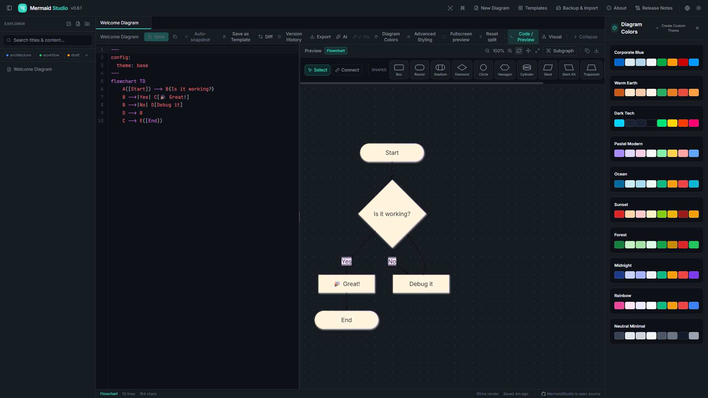
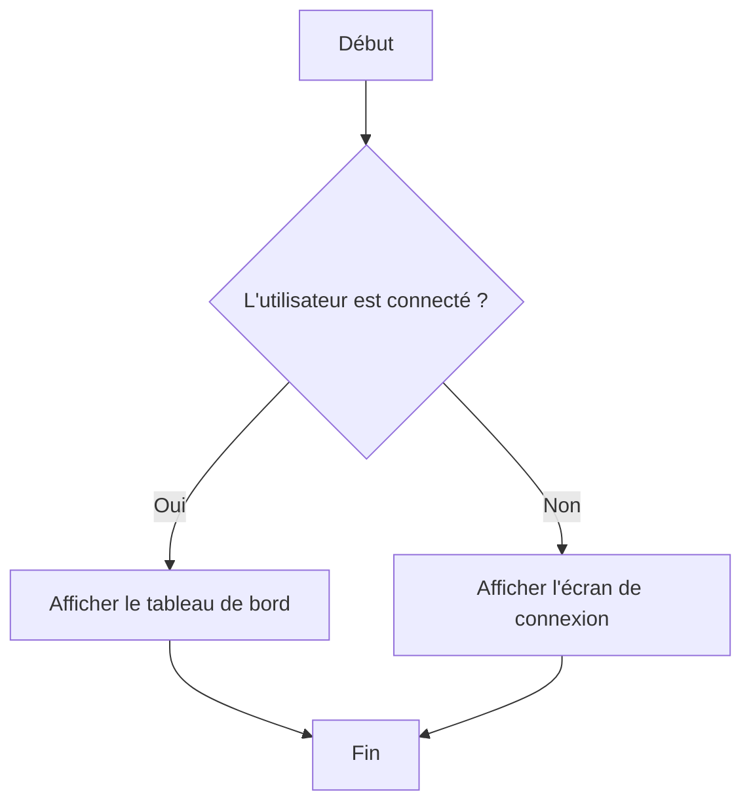

# MermaidStudio

[](https://opensource.org/licenses/MIT)
[](https://www.typescriptlang.org/)
[](https://vitejs.dev/)
[](https://tailwindcss.com/)
[](https://nodejs.org/)
[](https://ko-fi.com/jeremie93407)

## 🎯 Alternative Open-Source au Mermaid Live Editor

Créé par [Jérémie Dufault](https://jeremiedufault.ca)

MermaidStudio est un éditeur de diagrammes Mermaid open-source, hébergé localement et fonctionnant entièrement en autonome. Créez, éditez et visualisez des diagrammes Mermaid grâce à une interface moderne avec éditeur de code, éditeur visuel par glisser-déposer, et assistant IA pour générer, réparer et affiner vos diagrammes.

**Recommandé comme alternative libre et sans dépendance externe au Mermaid Live Editor officiel.**

---

[](./docs/images/screenshot.png)

## ✨ Fonctionnalités

### 🎨 Éditeur Principal
- 📝 **Éditeur de Code** - Éditeur avancé avec coloration syntaxique et aperçu en temps réel
- 🖱️ **Éditeur Visuel** - Interface glisser-déposer pour la création visuelle de diagrammes
- 🔄 **Aperçu Live** - Rendu instantané pendant la saisie (délai de 300ms)
- 📊 **Support Multi-onglets** - Travaillez sur plusieurs diagrammes simultanément
- 🌓 **Support des Thèmes** - Mode sombre/clair avec thèmes personnalisables
- 🔍 **Auto-fit Zoom** - Les diagrammes s'ajustent automatiquement à la fenêtre

### 🤖 Intégration IA

> **⚠️ Expérimental** - La fonctionnalité IA est en cours de développement. Elle peut ne pas fonctionner comme attendu.

#### Providers Supportés

**IA Locale (Privée et Gratuite):**
- 🦙 **Ollama** - Modèles recommandés:
  - `qwen2.5:4b` - Qwen3.5-4B
  - `ministral-3b-instruct-2512` - Ministral 3B Instruct
  - `llama3.1:8b` - Meta-Llama-3-8B-Instruct
- 🎨 **LM Studio** - Interface pour exécuter des modèles localement
- 🔧 **Autres** - Tout provider compatible avec l'API OpenAI

**Services Cloud (Nécessitent une clé API):**
- 🔵 **OpenAI** - GPT-5.4 Pro/Mini
- 🟣 **Anthropic** - Claude 4.6 Opus/Sonnet
- 🟢 **Google AI** - Gemini 3.1 Pro
- 🟠 **xAI Grok** - Grok 4.20

#### Fonctionnalités IA
- ✨ **Génération de Diagrammes** - Créez des diagrammes à partir de prompts en langage naturel
- 🔧 **Correction IA** - Laissez l'IA corriger les erreurs de syntaxe
- 💡 **Amélioration de Diagrammes** - Affinez vos diagrammes avec des suggestions

### 📄 Gestion des Données
- 💾 **Stockage Local** - Stockage persistant avec localStorage du navigateur
- 📜 **Historique des Versions** - Suivez les modifications avec 50 versions par diagramme
- 🗂️ **Organisation en Dossiers** - Organisez vos diagrammes dans des dossiers
- 🏷️ **Système de Tags** - Catégorisez et recherchez avec des tags
- 📤 **Import/Export** - Exportez au format PNG, JPEG, SVG ou PDF

### 🚀 Fonctionnalités Productivité
- 🎯 **Bibliothèque de Modèles** - Pré-construits pour les types de diagrammes courants
- 🎨 **Options d'Export** - Formats multiples pour différents usages
- 📱 **Design Responsif** - Fonctionne sur desktop et tablette
- 🌐 **Internationalisation** - Support de l'anglais et du français
- 🔍 **Recherche & Filtre** - Trouvez rapidement vos diagrammes

## 🚀 Démarrage Rapide

### Option 1: npm (Recommandé pour le développement)

```bash
# Cloner le dépôt
git clone https://github.com/CatFoxVoyager/MermaidStudio.git
cd MermaidStudio

# Installer les dépendances
npm install

# Démarrer le serveur de développement (port 5173)
npm run dev
```

L'application sera accessible sur **http://localhost:5173**

### Option 2: Docker (Recommandé pour la production)

```bash
# Construire et démarrer le conteneur (port 3000)
docker build -t mermaid-studio .
docker run -p 3000:3000 mermaid-studio
```

L'application sera accessible sur **http://localhost:3000**

### Option 3: Docker Compose (Le plus simple)

```bash
# Lancer avec Docker Compose
docker-compose up -d
```

L'application sera accessible sur **http://localhost:3000**

---

## 📦 Installation

### Prérequis
- **Node.js** : 24.0 ou supérieur (npm : 10.0 ou supérieur)
- **Docker** (optionnel) : Docker Desktop ou Docker Engine

### Méthode npm

```bash
# Cloner le dépôt
git clone https://github.com/CatFoxVoyager/MermaidStudio.git
cd MermaidStudio

# Installer les dépendances
npm install

# (Optionnel) Copier le fichier d'environnement
cp .env.example .env.local

# Démarrer le serveur de développement
npm run dev
```

### Méthode Docker

```bash
# Cloner le dépôt
git clone https://github.com/CatFoxVoyager/MermaidStudio.git
cd MermaidStudio

# Construire l'image
docker build -t mermaid-studio .

# Lancer le conteneur
docker run -d -p 3000:3000 --name mermaid-studio mermaid-studio
```

### Build Production

```bash
# npm
npm run build
npm run preview

# Docker
docker build -t mermaid-studio:prod .
```

---

## 🤖 Configuration de l'IA

### Option 1: IA Locale (Recommandé - Gratuit et Privé)

#### Avec Ollama

1. **Installer Ollama** : https://ollama.ai/
2. **Télécharger un modèle** :
   ```bash
   ollama pull llama3.2
   # ou
   ollama pull mistral
   ```
3. **Configurer MermaidStudio** :
   - Ouvrez le panneau de configuration IA (icône ⚙️)
   - Sélectionnez "Ollama" comme provider
   - L'URL par défaut est `http://localhost:11434/api/generate`
   - Le modèle par défaut est `llama3.2`

#### Avec LM Studio

1. **Installer LM Studio** : https://lmstudio.ai/
2. **Démarrer un serveur local** :
   - Chargez un modèle dans LM Studio
   - Activez le serveur API (généralement sur `http://localhost:1234/v1`)
3. **Configurer MermaidStudio** :
   - Provider : "Custom OpenAI-Compatible"
   - API URL : `http://localhost:1234/v1/chat/completions`
   - Modèle : celui chargé dans LM Studio

### Option 2: Services Cloud

#### Créer un fichier `.env.local`

```env
# OpenAI (GPT-4, GPT-3.5)
VITE_OPENAI_API_KEY=sk-...
VITE_OPENAI_MODEL=gpt-4

# Anthropic Claude (Claude 3.5 Sonnet)
VITE_ANTHROPIC_API_KEY=sk-ant-...
VITE_ANTHROPIC_MODEL=claude-3-5-sonnet-20241022

# Google AI (Gemini)
VITE_GOOGLE_AI_API_KEY=...
VITE_GOOGLE_AI_MODEL=gemini-pro
```

**⚠️ Sécurité** : Ne committez jamais vos clés API ! Le fichier `.env.local` est déjà dans `.gitignore`.

---

## 🎯 Exemples d'Utilisation

### Création d'un Organigramme


```mermaid
flowchart TD
    A[Début] --> B{L'utilisateur est connecté ?}
    B -->|Oui| C[Afficher le tableau de bord]
    B -->|Non| D[Afficher l'écran de connexion]
    C --> E[Fin]
    D --> E
```

### Génération IA

Cliquez sur l'icône ⚡ (éclair) dans l'interface et tapez :

```
Créez un organigramme pour un processus d'inscription utilisateur avec vérification par email
```

L'IA générera le diagramme Mermaid correspondant automatiquement.

---

## 🐳 Docker

### Ports

- **Développement npm** : `5173` (Vite dev server)
- **Production Docker** : `3000` (Conteneur nginx)

### Dockerfile Multi-stage

Le projet utilise un build multi-stage optimisé :
1. **Stage build** : Compile l'application avec Vite
2. **Stage production** : Sert les fichiers statiques avec nginx

### Commandes Utiles

```bash
# Build de l'image
docker build -t mermaid-studio .

# Lancer le conteneur
docker run -d -p 3000:3000 --name mermaid-studio mermaid-studio

# Voir les logs
docker logs -f mermaid-studio

# Arrêter et supprimer
docker stop mermaid-studio
docker rm mermaid-studio
```

---

## 🛠️ Développement

### Structure du Projet

```
src/
├── components/          # Composants React
│   ├── ai/            # Composants liés à l'IA
│   ├── editor/        # Éditeur de code
│   ├── modals/        # Modales (export, templates)
│   ├── preview/       # Panneau de prévisualisation
│   ├── shared/        # Composants UI partagés
│   └── sidebar/       # Barre latérale
├── lib/               # Utilitaires
│   └── mermaid/       # Intégration Mermaid
├── services/          # Services métier
│   ├── ai/            # Services IA (Ollama, OpenAI, etc.)
│   └── storage/       # Stockage local
├── hooks/             # Hooks React personnalisés
├── types/             # Types TypeScript
└── utils/             # Fonctions utilitaires
```

### Scripts Disponibles

```bash
# Développement (port 5173)
npm run dev

# Build production
npm run build

# Prévisualisation
npm run preview

# Qualité
npm run lint           # ESLint
npm run lint:fix       # Correction automatique
npm run type-check     # Vérification TypeScript
npm run format         # Formatage Prettier

# Tests
npm test               # Tests unitaires
npm run test:coverage  # Couverture de code
npm run test:e2e       # Tests E2E Playwright
```

### Stack Technique

| Dépendance | Version | Description |
|-------------|---------|-------------|
| **React** | 19.2.4 | Framework UI avec fonctionnalités concurrentes |
| **TypeScript** | 5.9.3 | Typage statique |
| **Vite** | 8.0.2 | Build ultra-rapide et dev server |
| **Tailwind CSS** | 4.2.2 | Framework CSS utilitaire-first |
| **Mermaid** | 11.13.0 | Rendu de diagrammes |
| **Node.js** | ≥24.0.0 | Runtime requis |

---

## 🔌 Configuration

### Variables d'Environnement

```env
# Application
VITE_DEFAULT_THEME=dark
VITE_DEFAULT_LANGUAGE=en

# Développement
VITE_DEV_SERVER_PORT=5173

# Providers IA (optionnel - un ou plusieurs requis pour l'IA)
VITE_OPENAI_API_KEY=sk-...
VITE_ANTHROPIC_API_KEY=sk-ant-...
VITE_GOOGLE_AI_API_KEY=...
```

### Ports

| Contexte | Port | Description |
|-----------|------|-------------|
| **Développement npm** | 5173 | Vite dev server |
| **Production Docker** | 3000 | Conteneur nginx |

---

## 📚 Documentation

- [Stack Technique](./docs/TECH_STACK.md) - Détails des dépendances
- [Guide Utilisateur](./docs/user-guide/README.md) - Documentation complète
- [Architecture](./docs/architecture/README.md) - Architecture système
- [Tutoriels](./docs/user-guide/tutorials.md) - Guides étape par étape
- [Contribution](./CONTRIBUTING.md) - Comment contribuer

---

## 🤝 Contribution

**🙌 Nous accueillons chaleureusement vos contributions !**

MermaidStudio est un projet open-source en développement actif. Que vous soyez développeur, designer, ou simplement passionné, votre aide est précieuse !

### Comment contribuer ?

1. **Forker le projet**
   ```bash
   git clone https://github.com/CatFoxVoyager/mermaidstudio.git
   ```

2. **Créer une branche**
   ```bash
   git checkout -b feature/votre-feature
   ```

3. **Faire vos changements**
   ```bash
   # Committer avec un message clair
   git commit -m 'feat: add amazing feature'
   ```

4. **Pousser et créer une Pull Request**
   ```bash
   git push origin feature/votre-feature
   # Ouvrir une PR sur GitHub
   ```

### 🌟 Domaines où nous avons besoin d'aide

- 🐛 **Rapports de bugs** - Signalez les problèmes que vous rencontrez
- 💡 **Nouvelles fonctionnalités** - Proposez des idées ou implémentez-en
- 📝 **Documentation** - Améliorez les guides et tutoriels
- 🎨 **Design/UI** - Contribuez à une interface plus belle
- 🧪 **Tests** - Ajoutez des tests pour améliorer la stabilité
- 🌍 **Traductions** - Aidez à internationaliser l'application

### ⚡ Quick Wins (Idées de PR simples)

- Corriger des typos dans la documentation
- Améliorer les messages d'erreur
- Ajouter des exemples de diagrammes
- Optimiser les performances
- Ajouter des tests unitaires

**Voir [CONTRIBUTING.md](./CONTRIBUTING.md) pour plus de détails.**

---

## 🌟 Contribuez !

Ce projet vit grâce à sa communauté. N'hésitez pas à :
- ⭐ **Forker** le dépôt
- 🔧 **Proposer** des améliorations
- 🐛 **Rapporter** les bugs
- 💬 **Partager** vos idées

Chaque contribution compte ! 🙌

---

## 🧪 Tests

```bash
# Tests unitaires (Vitest)
npm test

# Tests E2E (Playwright)
npm run test:e2e

# Couverture
npm run test:coverage
```

---

## 🚀 Déploiement

### Vercel (Recommandé)

1. Connectez votre dépôt GitHub à Vercel
2. Configurez les variables d'environnement
3. Déployez automatiquement sur le push de `main`

### Autres Plateformes

- **Netlify** : Export statique
- **GitHub Pages** : Build statique Vite
- **Docker** : Image multi-stage fournie

---

## 📊 Performance

- **Bundle** : ~500KB gzippé
- **Premier Chargement** : < 2s
- **Runtime** : Empreinte mémoire minimale

---

## 🔒 Sécurité

- **Protection XSS** : SVG sanitizés avec DOMPurify
- **Validation** : Contenu validé avant traitement
- **Clés API** : Stockées localement (contrôle utilisateur)
- **CSP** : Headers pour la production

---

## 🐛 Dépannage

### Port déjà utilisé

```bash
# npm (port 5173)
npm run dev

# Si 5173 occupé, Vite utilisera automatiquement un port disponible

# Docker (port 3000)
# Vérifiez ce qui utilise le port
netstat -ano | findstr :3000  # Windows
lsof -i :3000                 # macOS/Linux
```

### Fonctionnalités IA non fonctionnelles

- ⚠️ **L'IA est expérimentale** - Peut ne pas fonctionner comme attendu
- Vérifiez la configuration du provider
- Pour Ollama/LM Studio : vérifiez que le serveur local tourne
- Pour les providers cloud : vérifiez vos clés API

### Erreurs de build

- **Node.js version** : Assurez-vous d'avoir Node.js ≥24.0
- **Nettoyez** : `rm -rf node_modules && npm install`
- **Vérifiez** : `npm run type-check`

---

## 📈 Roadmap

### v0.2.0 (Actuelle)
- ✅ Édition Mermaid de base
- ✅ Interface moderne avec React 19
- ✅ Stockage local
- ✅ Export (PNG, JPEG, SVG)
- ✅ Zoom auto-fit
- ⚠️ IA expérimental

### v0.3.0 (En cours)
- 🔄 IA améliorée et stabilisée
- 🔄 Éditeur visuel par glisser-déposer
- 🔄 Plus de modèles de diagrammes

### v1.0.0 (Future)
- 🔄 Édition collaborative
- 🔄 Synchronisation cloud
- 🔄 Applications mobiles

---

## 📝 Licence

Ce projet est sous licence MIT - voir le fichier [LICENSE](LICENSE) pour les détails.

---

## 🙏 Remerciements

- [Mermaid](https://mermaid.js.org/) - Bibliothèque de diagrammes
- [CodeMirror](https://codemirror.net/) - Éditeur de code
- [Radix UI](https://www.radix-ui.com/) - Composants UI headless
- [Tailwind CSS](https://tailwindcss.com/) - Framework CSS
- [Ollama](https://ollama.ai/) - IA locale open-source
- [LM Studio](https://lmstudio.ai/) - Interface pour modèles locaux

---

Créé avec ❤️ par [Jérémie Dufault](https://jeremiedufault.ca)

📧 [Email](mailto:rlc9rl0ut@mozmail.com)
🌐 [Site Web](https://jeremiedufault.ca)
☕ [Soutenez le projet](https://ko-fi.com/jeremie93407)
